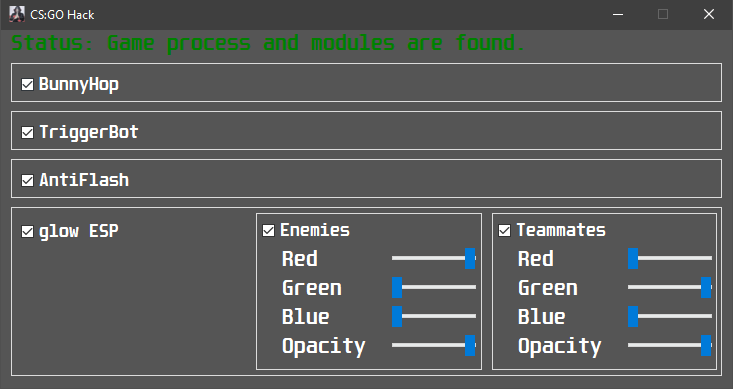
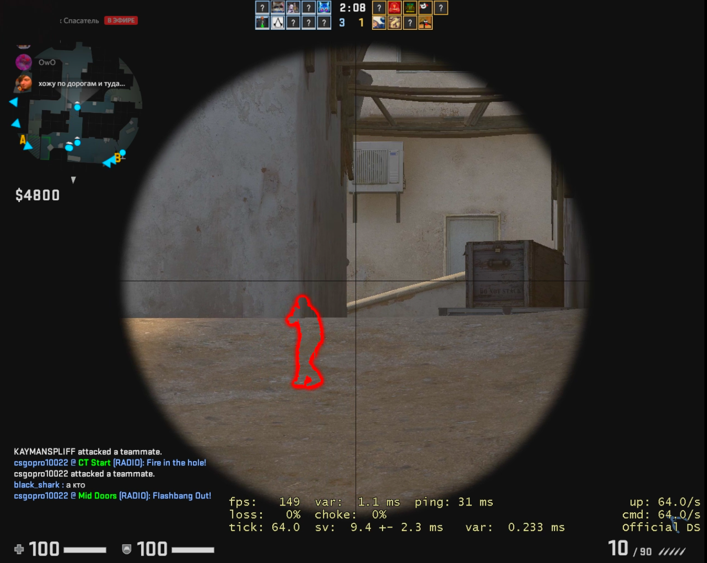

# external_hack
<b>Simple CS:GO external hack. Written only for studying puproses. 
What is implemented:</b>
- WallHack. (Glow ESP for teammates/enemies) 
  - Changing colours/opacity of glowing.
- TriggerBot. (aka autoshoot)
- Antiflash.
- BunnyHop.
- External GUI to control all this stuff.

<h3> Menu:</h3>

<h3> Hack itself: </h3>

To make it work all you need is to find up to date signatures and netvars.  
I ***don't promise*** that you won't get banned for using my hack. <s>VAC has very strong protection, so don't cheat or you will be banned!</s>
